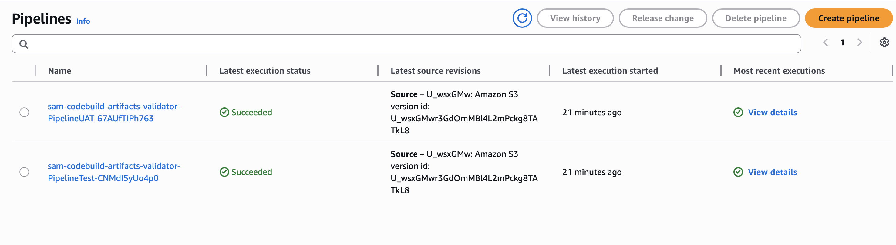
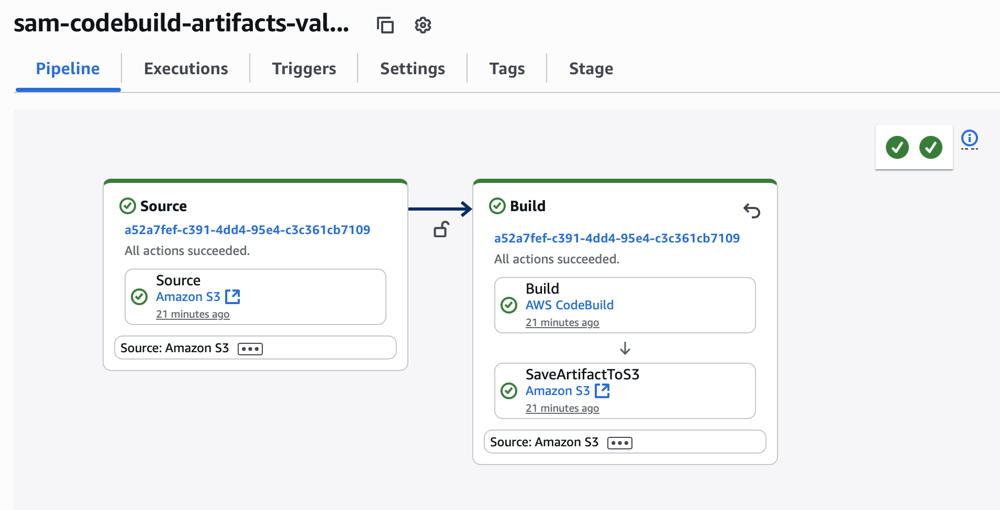
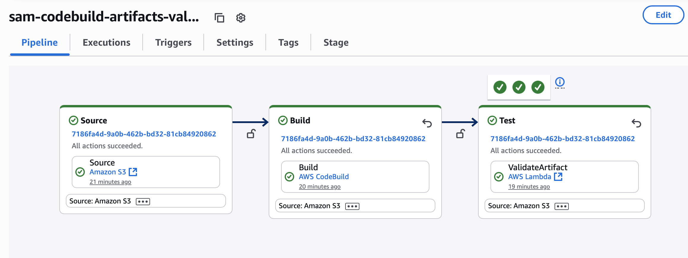
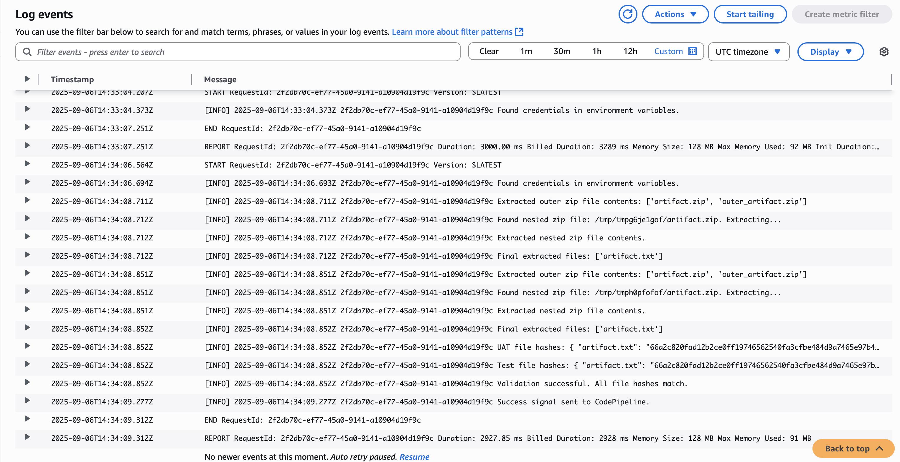
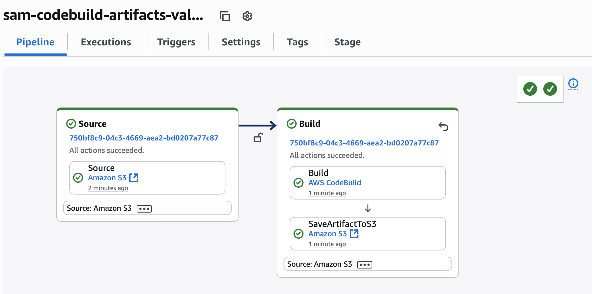
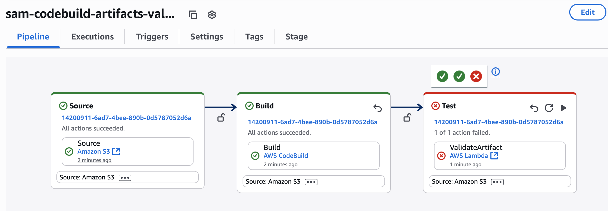
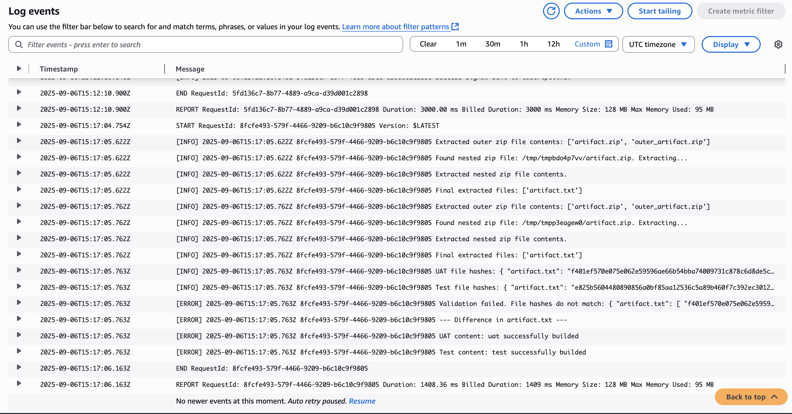

# Labs
All experiments describes as **CloudFormation** templates or **SAM** projects because they provide a declarative way to manage AWS resources - easy to create, easy to clean up and avoid redundant charges.

## Experiments
1. [Web application errors monitoring](#web-application-errors-monitoring)
2. [Lambda Authorizer](#lambda-authorizer)
3. [Lambda Update Strategy](#lambda-update-strategy)
4. [CodeBuild Artifacts Validator](#codebuild-artifacts-validator)


### Web application errors monitoring
This experiment demonstrates how to monitor errors in a web application using AWS services and receive notifications.

**Type:** CloudFormation

**Template:** [application-errors-monitoring](application-errors-monitoring/deploy.yaml)

**AWS Resources**:
- Elastic Load Balancer (ELB)
- EC2 instance
- CloudWatch Logs Group
- SNS topic

1. **Prepare the environment** (some CloudFormation parameters use SSM)
    - add your ssh key pair (if not already added)
        ```bash
        aws ec2 import-key-pair --key-name <your-key-name> --public-key-material file://~/.ssh/id_rsa.pub
        ```
    - add key pair name into the Parameter Store
        ```bash
        aws ssm put-parameter --name ssh-key-name --type String --value <your-key-name>
        ```
    - add email address into the Parameter Store
        ```bash
        aws ssm put-parameter --name sns-email-notification-address --type String --value <your-email-address>
        ```

2. **Deploy the CloudFormation stack**
    ```bash
    # Set up the web application monitoring environment
    aws cloudformation create-stack --stack-name app-errors-monitoring --template-body file://application-errors-monitoring/deploy.yaml --capabilities CAPABILITY_IAM CAPABILITY_NAMED_IAM

    # DON'T FORGET TO CONFIRM SNS EMAIL SUBSCRIPTION https://docs.aws.amazon.com/sns/latest/dg/SendMessageToHttp.confirm.html

    # Get web application URL
    URL=$(aws cloudformation describe-stacks --stack-name app-errors-monitoring --query "Stacks[0].Outputs[?OutputKey=='WebAppUrl'].OutputValue" --output text)

    # Check web application health
    curl $URL

    # Generate bad client codes
    for i in {1..5}; do curl -f $URL/does-not-exist-path; done
    ```

3. **Cleanup all resources**
    ```bash
    aws cloudformation delete-stack --stack-name app-errors-monitoring
    ```


### Lambda Authorizer
This experiment demonstrates how to implement a Lambda Authorizer for API Gateway with custom authentication logic.

**Type:** Serverless Application Model (SAM)

**Extended Documentation:** [Lambda Authorizer Documentation](lambda-authorizer/README.md)

**Template:** [lambda-authorizer/deploy.yaml](lambda-authorizer/deploy.yaml)

**AWS Resources:**
- Lambda functions (Mock Authorizer and Main Function)
- API Gateway
- IAM Role (for Lambda execution)

1. **Prepare the environment** (S3 bucket for packaged Lambda function)
    ```bash
    aws s3 mb s3://lambda-authorizer-demo-packaged
    ```

2. **Build and package the Lambda function**
    ```bash
       sam build --use-container
       sam package \
         --template-file template.yaml \
         --output-template-file packaged-template.yaml \
         --s3-bucket lambda-authorizer-demo-packaged
    ```

3. **Deploy the Lambda Authorizer + API Gateway + Mock Integration**
    ```bash
        sam deploy \
            --template-file packaged-template.yaml \
            --stack-name sam-lambda-authorizer-demo \
            --capabilities CAPABILITY_IAM \
            --confirm-changeset
    ```

4. **Test the API Gateway endpoint**
    Get API Gateway endpoint
    ```bash
        URL=$(aws cloudformation describe-stacks --stack-name sam-lambda-authorizer-demo --query "Stacks[0].Outputs[?OutputKey=='ApiEndpoint'].OutputValue" --output text)
    ```

    Test the API Gateway endpoint: 401 Unauthorized
    ```bash
        curl -v $URL/Prod/hello
    ```

    Test the API Gateway endpoint with invalid token (will return 401 Unauthorized)
    ```bash
        curl -v -H "Authorization: Bearer wrong-token" $URL/Prod/hello
    ```

    Test the API Gateway endpoint with valid token
    ```bash
        curl -v -H "Authorization: Bearer valid-token" $URL/Prod/hello
    ```

5. **Cleanup all resources**
    ```bash
    sam delete --stack-name sam-lambda-authorizer-demo
    aws s3 rb s3://lambda-authorizer-demo-packaged --force
    ```

### Lambda Update Strategy
This experiment demonstrates how to implement a different update strategies for AWS Lambda functions using AWS SAM.

**Type:** Serverless Application Model (SAM)

**Extended Documentation:** [Lambda Update Strategy Documentation](lambda-update-strategy/README.md) (auto-generated from AWS SAM Quick Template)

**Template:** [lambda-update-strategy/deploy.yaml](lambda-update-strategy/deploy.yaml)

**AWS Resources:**
- Application Insights
- CodeDeploy
- IAM Roles
- Lambda Function
- API Gateway

1. **Prepare the environment**
    ```bash
    aws s3 mb s3://lambda-update-strategy-demo-packaged
    ```

2. **Build and package the Lambda function**
    ```bash
       sam build --use-container
       sam package \
         --template-file template.yaml \
         --output-template-file packaged-template.yaml \
         --s3-bucket lambda-update-strategy-demo-packaged
    ```

3. **Deploy the Lambda function + API Gateway**
    ```bash
        sam deploy \
            --template-file packaged-template.yaml \
            --stack-name sam-lambda-update-strategy-demo \
            --capabilities CAPABILITY_IAM \
            --confirm-changeset
    ```
    Test connection
    ```bash
        URL=$(aws cloudformation describe-stacks --stack-name sam-lambda-update-strategy-demo --query "Stacks[0].Outputs[?OutputKey=='ApiEndpoint'].OutputValue" --output text)
        curl $URL
    ```
    Output
    ```json
        {"message": "Hello world. Lambda v1.0 (CodeDeployDefault.LambdaAllAtOnce)"}
    ```

4. **Testing Canary Deployment**
    - Edit the constant `RELEASE_VERSION` in the [hello_world/app.py](hello_world/app.py) file to change the version number to `v1.1` and re-build the package
    ```bash
       sam build --use-container
       sam package \
         --template-file template.yaml \
         --output-template-file packaged-template.yaml \
         --s3-bucket lambda-update-strategy-demo-packaged
    ```
    - Update stack with new update strategy
    ```bash
        sam deploy \
            --template-file packaged-template.yaml \
            --stack-name sam-lambda-update-strategy-demo \
            --capabilities CAPABILITY_IAM \
            --parameter-overrides DeploymentStrategy=CodeDeployDefault.LambdaCanary10Percent5Minutes \
            --confirm-changeset
    ```
    - Test the API Gateway endpoint during deployment
    ```bash
        URL=$(aws cloudformation describe-stacks --stack-name sam-lambda-update-strategy-demo --query "Stacks[0].Outputs[?OutputKey=='ApiEndpoint'].OutputValue" --output text)
        for j in {1..3}; do for i in {1..10}; do curl $URL && echo ""; done; [ $j -lt 5 ] && sleep 150 && echo "Next batch..."; done
    ```
    The part of request that is being tested is the response from the Lambda function, which should now include the updated version number. Something like this:
    ```json
        {"message": "Hello world. Lambda v1.0 (CodeDeployDefault.LambdaAllAtOnce)"}
        {"message": "Hello world. Lambda v1.0 (CodeDeployDefault.LambdaAllAtOnce)"}
        {"message": "Hello world. Lambda v1.0 (CodeDeployDefault.LambdaAllAtOnce)"}
        {"message": "Hello world. Lambda v1.0 (CodeDeployDefault.LambdaAllAtOnce)"}
        {"message": "Hello world. Lambda v1.0 (CodeDeployDefault.LambdaAllAtOnce)"}
        {"message": "Hello world. Lambda v1.0 (CodeDeployDefault.LambdaAllAtOnce)"}
        {"message": "Hello world. Lambda v1.0 (CodeDeployDefault.LambdaAllAtOnce)"}
        {"message": "Hello world. Lambda v1.0 (CodeDeployDefault.LambdaAllAtOnce)"}
        {"message": "Hello world. Lambda v1.0 (CodeDeployDefault.LambdaAllAtOnce)"}
        {"message": "Hello world. Lambda v1.0 (CodeDeployDefault.LambdaAllAtOnce)"}
        Next batch...
        {"message": "Hello world. Lambda v1.0 (CodeDeployDefault.LambdaAllAtOnce)"}
        {"message": "Hello world. Lambda v1.0 (CodeDeployDefault.LambdaAllAtOnce)"}
        {"message": "Hello world. Lambda v1.0 (CodeDeployDefault.LambdaAllAtOnce)"}
        {"message": "Hello world. Lambda v1.0 (CodeDeployDefault.LambdaAllAtOnce)"}
        {"message": "Hello world. Lambda v1.0 (CodeDeployDefault.LambdaAllAtOnce)"}
        {"message": "Hello world. Lambda v1.1 (CodeDeployDefault.LambdaCanary10Percent5Minutes)"}
        {"message": "Hello world. Lambda v1.1 (CodeDeployDefault.LambdaCanary10Percent5Minutes)"}
        {"message": "Hello world. Lambda v1.1 (CodeDeployDefault.LambdaCanary10Percent5Minutes)"}
        {"message": "Hello world. Lambda v1.1 (CodeDeployDefault.LambdaCanary10Percent5Minutes)"}
        {"message": "Hello world. Lambda v1.1 (CodeDeployDefault.LambdaCanary10Percent5Minutes)"}
        Next batch...
        {"message": "Hello world. Lambda v1.1 (CodeDeployDefault.LambdaCanary10Percent5Minutes)"}
        {"message": "Hello world. Lambda v1.1 (CodeDeployDefault.LambdaCanary10Percent5Minutes)"}
        {"message": "Hello world. Lambda v1.1 (CodeDeployDefault.LambdaCanary10Percent5Minutes)"}
        {"message": "Hello world. Lambda v1.1 (CodeDeployDefault.LambdaCanary10Percent5Minutes)"}
        {"message": "Hello world. Lambda v1.1 (CodeDeployDefault.LambdaCanary10Percent5Minutes)"}
        {"message": "Hello world. Lambda v1.1 (CodeDeployDefault.LambdaCanary10Percent5Minutes)"}
        {"message": "Hello world. Lambda v1.1 (CodeDeployDefault.LambdaCanary10Percent5Minutes)"}
        {"message": "Hello world. Lambda v1.1 (CodeDeployDefault.LambdaCanary10Percent5Minutes)"}
        {"message": "Hello world. Lambda v1.1 (CodeDeployDefault.LambdaCanary10Percent5Minutes)"}
        {"message": "Hello world. Lambda v1.1 (CodeDeployDefault.LambdaCanary10Percent5Minutes)"}
    ```


5. **Testing Linear Deployment**
    - Edit the constant `RELEASE_VERSION` in the [hello_world/app.py](hello_world/app.py) file to change the version number to `v1.2` and re-build the application
   ```bash
       sam build --use-container
       sam package \
         --template-file template.yaml \
         --output-template-file packaged-template.yaml \
         --s3-bucket lambda-update-strategy-demo-packaged
   ```
   - Update stack with new update strategy
   ```bash
        sam deploy \
        --template-file packaged-template.yaml \
        --stack-name sam-lambda-update-strategy-demo \
        --capabilities CAPABILITY_IAM \
        --parameter-overrides DeploymentStrategy=CodeDeployDefault.LambdaLinear10PercentEvery1Minute \
        --confirm-changeset
   ```
   - Test the API Gateway endpoint again to see the updated response.
   ```bash
    URL=$(aws cloudformation describe-stacks --stack-name sam-lambda-update-strategy-demo --query "Stacks[0].Outputs[?OutputKey=='ApiEndpoint'].OutputValue" --output text)
    for j in {1..10}; do for i in {1..10}; do curl $URL && echo ""; done; [ $j -lt 5 ] && sleep 60 && echo "Next batch..."; done
   ```
    The part of request that is being tested is the response from the Lambda function, which should now include the updated version number. Something like this:
    ```json
    {"message": "Hello world. Lambda v1.1 (CodeDeployDefault.LambdaCanary10Percent5Minutes)"}
    {"message": "Hello world. Lambda v1.1 (CodeDeployDefault.LambdaCanary10Percent5Minutes)"}
    {"message": "Hello world. Lambda v1.1 (CodeDeployDefault.LambdaCanary10Percent5Minutes)"}
    {"message": "Hello world. Lambda v1.1 (CodeDeployDefault.LambdaCanary10Percent5Minutes)"}
    {"message": "Hello world. Lambda v1.1 (CodeDeployDefault.LambdaCanary10Percent5Minutes)"}
    {"message": "Hello world. Lambda v1.1 (CodeDeployDefault.LambdaCanary10Percent5Minutes)"}
    {"message": "Hello world. Lambda v1.1 (CodeDeployDefault.LambdaCanary10Percent5Minutes)"}
    {"message": "Hello world. Lambda v1.1 (CodeDeployDefault.LambdaCanary10Percent5Minutes)"}
    {"message": "Hello world. Lambda v1.1 (CodeDeployDefault.LambdaCanary10Percent5Minutes)"}
    {"message": "Hello world. Lambda v1.1 (CodeDeployDefault.LambdaCanary10Percent5Minutes)"}
    Next batch...
    {"message": "Hello world. Lambda v1.1 (CodeDeployDefault.LambdaCanary10Percent5Minutes)"}
    {"message": "Hello world. Lambda v1.1 (CodeDeployDefault.LambdaCanary10Percent5Minutes)"}
    {"message": "Hello world. Lambda v1.1 (CodeDeployDefault.LambdaCanary10Percent5Minutes)"}
    {"message": "Hello world. Lambda v1.1 (CodeDeployDefault.LambdaCanary10Percent5Minutes)"}
    {"message": "Hello world. Lambda v1.1 (CodeDeployDefault.LambdaCanary10Percent5Minutes)"}
    {"message": "Hello world. Lambda v1.2 (CodeDeployDefault.LambdaLinear10PercentEvery1Minute)"}
    {"message": "Hello world. Lambda v1.1 (CodeDeployDefault.LambdaCanary10Percent5Minutes)"}
    {"message": "Hello world. Lambda v1.1 (CodeDeployDefault.LambdaCanary10Percent5Minutes)"}
    {"message": "Hello world. Lambda v1.1 (CodeDeployDefault.LambdaCanary10Percent5Minutes)"}
    {"message": "Hello world. Lambda v1.1 (CodeDeployDefault.LambdaCanary10Percent5Minutes)"}
    Next batch...
    {"message": "Hello world. Lambda v1.1 (CodeDeployDefault.LambdaCanary10Percent5Minutes)"}
    {"message": "Hello world. Lambda v1.1 (CodeDeployDefault.LambdaCanary10Percent5Minutes)"}
    {"message": "Hello world. Lambda v1.1 (CodeDeployDefault.LambdaCanary10Percent5Minutes)"}
    {"message": "Hello world. Lambda v1.1 (CodeDeployDefault.LambdaCanary10Percent5Minutes)"}
    {"message": "Hello world. Lambda v1.2 (CodeDeployDefault.LambdaLinear10PercentEvery1Minute)"}
    {"message": "Hello world. Lambda v1.1 (CodeDeployDefault.LambdaCanary10Percent5Minutes)"}
    {"message": "Hello world. Lambda v1.2 (CodeDeployDefault.LambdaLinear10PercentEvery1Minute)"}
    {"message": "Hello world. Lambda v1.1 (CodeDeployDefault.LambdaCanary10Percent5Minutes)"}
    {"message": "Hello world. Lambda v1.2 (CodeDeployDefault.LambdaLinear10PercentEvery1Minute)"}
    {"message": "Hello world. Lambda v1.1 (CodeDeployDefault.LambdaCanary10Percent5Minutes)"}
    Next batch...
    {"message": "Hello world. Lambda v1.1 (CodeDeployDefault.LambdaCanary10Percent5Minutes)"}
    {"message": "Hello world. Lambda v1.1 (CodeDeployDefault.LambdaCanary10Percent5Minutes)"}
    {"message": "Hello world. Lambda v1.1 (CodeDeployDefault.LambdaCanary10Percent5Minutes)"}
    {"message": "Hello world. Lambda v1.2 (CodeDeployDefault.LambdaLinear10PercentEvery1Minute)"}
    {"message": "Hello world. Lambda v1.2 (CodeDeployDefault.LambdaLinear10PercentEvery1Minute)"}
    {"message": "Hello world. Lambda v1.1 (CodeDeployDefault.LambdaCanary10Percent5Minutes)"}
    {"message": "Hello world. Lambda v1.2 (CodeDeployDefault.LambdaLinear10PercentEvery1Minute)"}
    {"message": "Hello world. Lambda v1.1 (CodeDeployDefault.LambdaCanary10Percent5Minutes)"}
    {"message": "Hello world. Lambda v1.1 (CodeDeployDefault.LambdaCanary10Percent5Minutes)"}
    {"message": "Hello world. Lambda v1.1 (CodeDeployDefault.LambdaCanary10Percent5Minutes)"}
    Next batch...
    {"message": "Hello world. Lambda v1.1 (CodeDeployDefault.LambdaCanary10Percent5Minutes)"}
    {"message": "Hello world. Lambda v1.2 (CodeDeployDefault.LambdaLinear10PercentEvery1Minute)"}
    {"message": "Hello world. Lambda v1.2 (CodeDeployDefault.LambdaLinear10PercentEvery1Minute)"}
    {"message": "Hello world. Lambda v1.1 (CodeDeployDefault.LambdaCanary10Percent5Minutes)"}
    {"message": "Hello world. Lambda v1.2 (CodeDeployDefault.LambdaLinear10PercentEvery1Minute)"}
    {"message": "Hello world. Lambda v1.2 (CodeDeployDefault.LambdaLinear10PercentEvery1Minute)"}
    {"message": "Hello world. Lambda v1.1 (CodeDeployDefault.LambdaCanary10Percent5Minutes)"}
    {"message": "Hello world. Lambda v1.2 (CodeDeployDefault.LambdaLinear10PercentEvery1Minute)"}
    {"message": "Hello world. Lambda v1.1 (CodeDeployDefault.LambdaCanary10Percent5Minutes)"}
    {"message": "Hello world. Lambda v1.1 (CodeDeployDefault.LambdaCanary10Percent5Minutes)"}
    Next batch...
    {"message": "Hello world. Lambda v1.1 (CodeDeployDefault.LambdaCanary10Percent5Minutes)"}
    {"message": "Hello world. Lambda v1.1 (CodeDeployDefault.LambdaCanary10Percent5Minutes)"}
    {"message": "Hello world. Lambda v1.2 (CodeDeployDefault.LambdaLinear10PercentEvery1Minute)"}
    {"message": "Hello world. Lambda v1.2 (CodeDeployDefault.LambdaLinear10PercentEvery1Minute)"}
    {"message": "Hello world. Lambda v1.1 (CodeDeployDefault.LambdaCanary10Percent5Minutes)"}
    {"message": "Hello world. Lambda v1.2 (CodeDeployDefault.LambdaLinear10PercentEvery1Minute)"}
    {"message": "Hello world. Lambda v1.2 (CodeDeployDefault.LambdaLinear10PercentEvery1Minute)"}
    {"message": "Hello world. Lambda v1.2 (CodeDeployDefault.LambdaLinear10PercentEvery1Minute)"}
    {"message": "Hello world. Lambda v1.2 (CodeDeployDefault.LambdaLinear10PercentEvery1Minute)"}
    {"message": "Hello world. Lambda v1.1 (CodeDeployDefault.LambdaCanary10Percent5Minutes)"}
    Next batch...
    {"message": "Hello world. Lambda v1.2 (CodeDeployDefault.LambdaLinear10PercentEvery1Minute)"}
    {"message": "Hello world. Lambda v1.2 (CodeDeployDefault.LambdaLinear10PercentEvery1Minute)"}
    {"message": "Hello world. Lambda v1.2 (CodeDeployDefault.LambdaLinear10PercentEvery1Minute)"}
    {"message": "Hello world. Lambda v1.1 (CodeDeployDefault.LambdaCanary10Percent5Minutes)"}
    {"message": "Hello world. Lambda v1.2 (CodeDeployDefault.LambdaLinear10PercentEvery1Minute)"}
    {"message": "Hello world. Lambda v1.1 (CodeDeployDefault.LambdaCanary10Percent5Minutes)"}
    {"message": "Hello world. Lambda v1.1 (CodeDeployDefault.LambdaCanary10Percent5Minutes)"}
    {"message": "Hello world. Lambda v1.2 (CodeDeployDefault.LambdaLinear10PercentEvery1Minute)"}
    {"message": "Hello world. Lambda v1.1 (CodeDeployDefault.LambdaCanary10Percent5Minutes)"}
    {"message": "Hello world. Lambda v1.2 (CodeDeployDefault.LambdaLinear10PercentEvery1Minute)"}
    Next batch...
    {"message": "Hello world. Lambda v1.2 (CodeDeployDefault.LambdaLinear10PercentEvery1Minute)"}
    {"message": "Hello world. Lambda v1.1 (CodeDeployDefault.LambdaCanary10Percent5Minutes)"}
    {"message": "Hello world. Lambda v1.1 (CodeDeployDefault.LambdaCanary10Percent5Minutes)"}
    {"message": "Hello world. Lambda v1.1 (CodeDeployDefault.LambdaCanary10Percent5Minutes)"}
    {"message": "Hello world. Lambda v1.1 (CodeDeployDefault.LambdaCanary10Percent5Minutes)"}
    {"message": "Hello world. Lambda v1.2 (CodeDeployDefault.LambdaLinear10PercentEvery1Minute)"}
    {"message": "Hello world. Lambda v1.1 (CodeDeployDefault.LambdaCanary10Percent5Minutes)"}
    {"message": "Hello world. Lambda v1.1 (CodeDeployDefault.LambdaCanary10Percent5Minutes)"}
    {"message": "Hello world. Lambda v1.1 (CodeDeployDefault.LambdaCanary10Percent5Minutes)"}
    {"message": "Hello world. Lambda v1.1 (CodeDeployDefault.LambdaCanary10Percent5Minutes)"}
    Next batch...
    {"message": "Hello world. Lambda v1.2 (CodeDeployDefault.LambdaLinear10PercentEvery1Minute)"}
    {"message": "Hello world. Lambda v1.1 (CodeDeployDefault.LambdaCanary10Percent5Minutes)"}
    {"message": "Hello world. Lambda v1.2 (CodeDeployDefault.LambdaLinear10PercentEvery1Minute)"}
    {"message": "Hello world. Lambda v1.1 (CodeDeployDefault.LambdaCanary10Percent5Minutes)"}
    {"message": "Hello world. Lambda v1.2 (CodeDeployDefault.LambdaLinear10PercentEvery1Minute)"}
    {"message": "Hello world. Lambda v1.2 (CodeDeployDefault.LambdaLinear10PercentEvery1Minute)"}
    {"message": "Hello world. Lambda v1.1 (CodeDeployDefault.LambdaCanary10Percent5Minutes)"}
    {"message": "Hello world. Lambda v1.2 (CodeDeployDefault.LambdaLinear10PercentEvery1Minute)"}
    {"message": "Hello world. Lambda v1.2 (CodeDeployDefault.LambdaLinear10PercentEvery1Minute)"}
    {"message": "Hello world. Lambda v1.1 (CodeDeployDefault.LambdaCanary10Percent5Minutes)"}
    {"message": "Hello world. Lambda v1.2 (CodeDeployDefault.LambdaLinear10PercentEvery1Minute)"}
    ```

6. **Cleanup all resources**
    ```bash
    sam delete --stack-name sam-lambda-update-strategy-demo
    aws s3 rb s3://lambda-update-strategy-demo-packaged --force
    ```

### CodeBuild Artifacts Validator
This project demonstrates a powerful integration pattern: using a Lambda function as a validation gate within an AWS CodePipeline. The Lambda is configured to be invoked as a CodePipeline action, where it analyzes and verifies artifacts produced by a preceding CodeBuild project. This pattern is highly adaptable and can be extended to various validation and automation tasks within CI/CD pipelines.

_This project demonstrates a solution to a common challenge: validating the integrity of artifacts produced by two independent build pipelines. While the architectural best practice is to create a single, immutable artifact and carry it between environments, we often have to work with existing infrastructure. This solution shows how to ensure build reproducibility and environment consistency without the need for a complete pipeline refactoring. It's a pragmatic approach to a real-world problem._

**Type:** Serverless Application Model (SAM)

**Extended Documentation:** [CodeBuild Artifacts Validator Documentation](codebuild-artifacts-validator/README.md)

**Template:** [codebuild-artifacts-validator/deploy.yaml](codebuild-artifacts-validator/deploy.yaml)

**AWS Resources:**
- CodeBuild Projects
- Lambda Function
- IAM Roles
- CodePipeline
- S3 Bucket
- CloudWatch Logs

1. **Prepare the environment: S3 bucket with versioning for source code** (versioning is required for the CodePipeline)
   ```bash
    aws s3 mb s3://codebuild-artifacts-validator
    aws s3api put-bucket-versioning --bucket codebuild-artifacts-validator --versioning-configuration Status=Enabled
   ```
   _S3 bucket will also be used as a source code repository instead of CodeCommit/GitHub/Gitlab/Bitbucket to avoid unnecessary complexity and additional dependencies._
2. **Upload the source code to the S3 bucket.**
   ```bash
   cd codebuild-artifacts-validator
   zip -r source.zip source
   aws s3 cp source.zip s3://codebuild-artifacts-validator
   ```
3. **Build and package SAM application.**
   ```bash
       sam build --use-container
       sam package \
         --template-file template.yaml \
         --output-template-file packaged-template.yaml \
         --s3-bucket codebuild-artifacts-validator
   ```
4. **Deploy the SAM application.**
   ```bash
   sam deploy \
     --template-file packaged-template.yaml \
     --stack-name sam-codebuild-artifacts-validator \
     --capabilities CAPABILITY_IAM \
     --disable-rollback \
     --parameter-overrides SourceBucket=codebuild-artifacts-validator
   ```
    Get CodeBuild AMIs list
    ```bash
    aws codebuild list-curated-environment-images
    ```
5. **Check results in CodePipeline Pipeline UI and CloudWatch Logs** (first result should show the successful validation).
    - [CodePipeline](https://us-east-1.console.aws.amazon.com/codesuite/codepipeline/pipelines)
    - [CloudWatch Logs](https://us-east-1.console.aws.amazon.com/cloudwatch/home)

    _Pipelines list_
    

    _TEST pipeline first run_
    
    _UAT pipeline first run_
    

    _CloudWatch Logs first run_
    

6. **Next, we will modify `buildspec.yml` file to make the artifacts with dynamic values.**
    - Add `${ENV}` variable in seventh line of [codebuild-artifacts-validator/source/buildspec.yml](codebuild-artifacts-validator/source/buildspec.yml), like this `echo "${ENV} successfully builded" > artifact.txt`
    - Create a new `source.zip` file and upload it to S3.
    ```bash
    zip -r source.zip source
    aws s3 cp source.zip s3://codebuild-artifacts-validator
    ```
    _Pipelines will be triggered automatically after the new source code is uploaded to S3. Just wait a few minutes for the pipelines to complete._

    __Test Pipeline Second Run__
    

    

    

**Notes**
- To simplify the example, the lambda template and code use a fixed name and path of the object with the artifact. But of course, this process can be made more flexible by removing the step with explicit storage of the object in `template.yaml` and modified the Lambda so that it automatically receives data about the `Test` build after completion and finds the created artifact in S3 by revision number (this is done by several additional methods through the `boto3` module).

7. **Cleanup resources**
   ```bash
    # A little bit more complex cleanup because the versioning was enabled
    VERSIONS=$(aws s3api list-object-versions --bucket codebuild-artifacts-validator --output json --query='{Objects: Versions[].{Key:Key,VersionId:VersionId},DeleteMarkers: DeleteMarkers[].{Key:Key,VersionId:VersionId}}')
    aws s3api delete-objects --bucket codebuild-artifacts-validator --delete "$(echo $VERSIONS | jq '{Objects: (.Objects + .DeleteMarkers), Quiet: true}')"
    aws s3 rb s3://codebuild-artifacts-validator --force

    VERSIONS=$(aws s3api list-object-versions --bucket sam-codebuild-artifacts-validator --output json --query='{Objects: Versions[].{Key:Key,VersionId:VersionId},DeleteMarkers: DeleteMarkers[].{Key:Key,VersionId:VersionId}}')
    aws s3api delete-objects --bucket sam-codebuild-artifacts-validator --delete "$(echo $VERSIONS | jq '{Objects: (.Objects + .DeleteMarkers), Quiet: true}')"
    aws s3 rb s3://sam-codebuild-artifacts-validator --force

    aws cloudformation delete-stack --stack-name sam-codebuild-artifacts-validator
   ```
